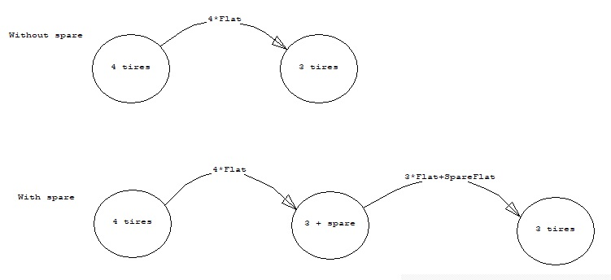
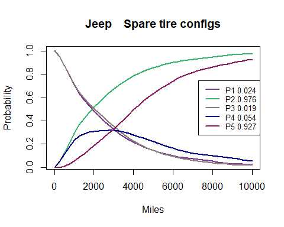
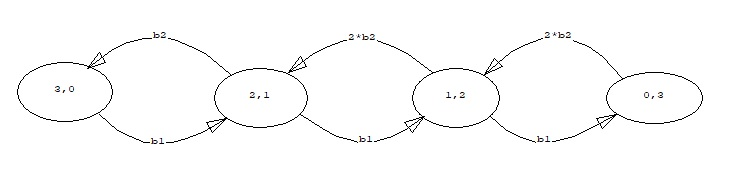
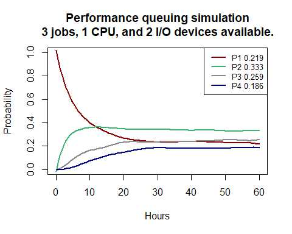
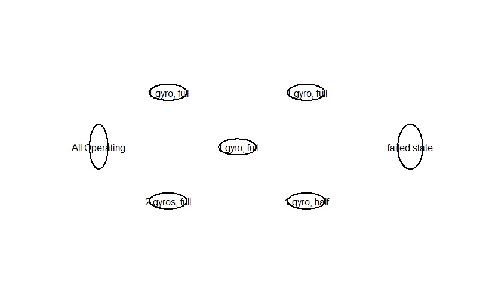
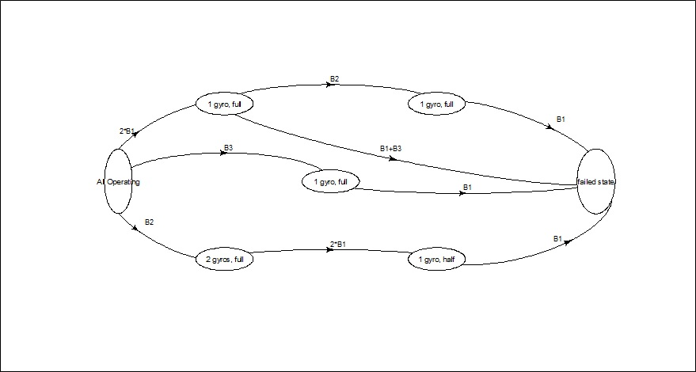
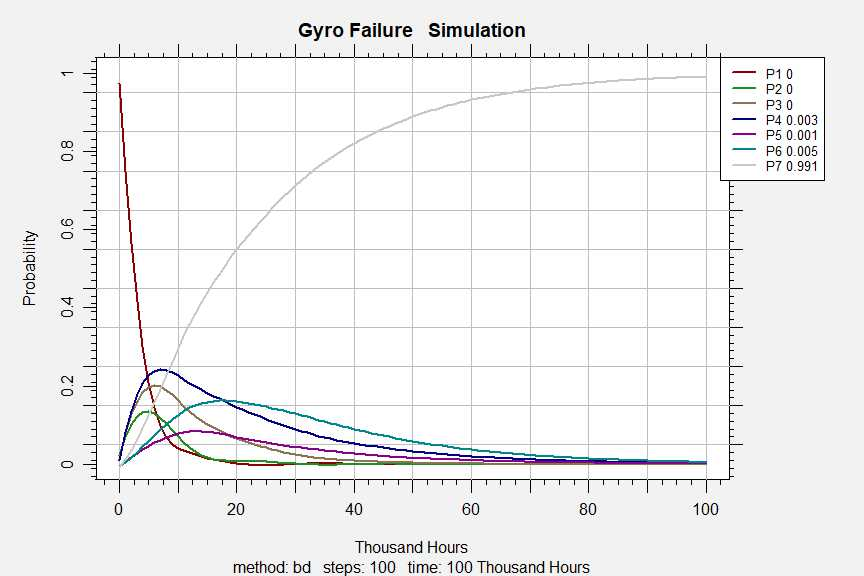

CARMSemu
========

 

This repository will contain progressive development utilizing the R Computing
environment https://www.r-project.org/ in an effort to emulate the functionality
of a CARMS program written by Paul Pukite and featured in his book “Modeling for
Reliability Analysis” ISBN: 978-0-780-33482-3. The reason for emulation is that
the CARMS program was written to run only in the Windows 3.1 operating system. R
provides a cross platform environment (Unix, Linux, Windows, macOS) and provides
for necessary upgrades as computer architectures progress.

The ultimate goal is to build an open source, emulated application package for
the R environment, perhaps named CARMS. The focus for now is on the back end
technical code that will generate matching results. Much attention must be given
to user interface and graphic representation of the Markov Models. This will all
take considerable development effort.

As a first step, a chained simulation algorithm has been written and tested
across a number of examples from the original CARMS distribution. Here a few of
these examples are demonstrated, with code that anyone can run in an R console.

jeep.R
------

-   This model considers 2 Markov chains for modest comparison in one run

-   Initial states are 1 and 3, both considering 4 tires working

-   State 2 indicates failure after one of the 4 tires goes flat

-   State 4 considers that a spare tire has been deployed

-   Finally state 5 indicates failure after one of the remaining 3 original
    tires or the spare go flat

~~~~~~~~~~~~~~~~~~~~~~~~~~~~~~~~~~~~~~~~~~~~~~~~~~~~~~~~~~~~~~~~~~~~~~~~~~~~~~~~
source("https://raw.githubusercontent.com/jto888/CARMSemu/main/examples/jeep.R")
~~~~~~~~~~~~~~~~~~~~~~~~~~~~~~~~~~~~~~~~~~~~~~~~~~~~~~~~~~~~~~~~~~~~~~~~~~~~~~~~

Execution of this simulation is slower than I would hope for. But this is still
only written in interpreted R core language, which is known to suffer given loop
functions with high cycles. Here, 5000 cycles seemed to be required to generate
pleasing smooth curves. In the future this simulation will be executed from
compiled C++ code with remarkably improved performance. I also suspect that
integration of the partial differential equations will generate smooth curves
more effectively.

 

Performance Queuing Simulation (percpuio)
-----------------------------------------

This model is based on 3 slots existing in a job queue for computer processing.
As the cpu processes a job the I/O system can place a new job into the queue.

In state 1 the queue is full with 3 jobs for the cpu to perform. The cpu can
perform one job at a time, so state 2 is arrived at where there are 2 jobs left
in the queue and one slot open. In state 2 the cpu can operate on a single job
or the I/O can refill the single open slot to alter the state. Since the cpu job
rate is somewhat higher than a single I/O rate there is a greater propensity to
move to state 3 where only one job is left in the queue. Since there are 2 slots
open at state 3, both of the available I/O units can be deployed to resupply the
queue. Finally, it is possible for the cpu to exhaust the job queue at state 4.
Since the 2 I/O units are available at state 4, refilling of job slots proceeds
and so there will be expected steady state performance over time.

This script now calls on the Runge-Kutta integration algorithm to resolve the
system of ordinary differential equations for this model.

~~~~~~~~~~~~~~~~~~~~~~~~~~~~~~~~~~~~~~~~~~~~~~~~~~~~~~~~~~~~~~~~~~~~~~~~~~~~~~~~
source("https://raw.githubusercontent.com/jto888/CARMSemu/main/examples/percpuio.R")
~~~~~~~~~~~~~~~~~~~~~~~~~~~~~~~~~~~~~~~~~~~~~~~~~~~~~~~~~~~~~~~~~~~~~~~~~~~~~~~~

CARMS object development and diagram building.
----------------------------------------------

Up to this point example scripts have been executable on an R Console without
any package installations. These scripts have demonstrated back end calculation
capabilities and rudimentary graphical response to results.

One of the key characteristics of the CARMS application is the user preparation
of Markov diagrams defining the model that will eventually be simulated. In the
case of the original CARMS application the user involvement was intended to be
interactive with a graphical screen. For this R emulation a different approach
is to be utilized.

In R it is expected that the graphical diagram capabilities of package ‘diagram’
will be used. In order to demonstrate diagramming examples a new user to R would
have to install package diagram into their R system.

### Installing package diagram

Since package ‘diagram’ is a long established member on the CRAN repository it
can be simply installed by copying the following line into the R Console:

~~~~~~~~~~~~~~~~~~~~~~~~~~~~~~~~~~~~~~~~~~~~~~~~~~~~~~~~~~~~~~~~~~~~~~~~~~~~~~~~
install.packages("diagram")
~~~~~~~~~~~~~~~~~~~~~~~~~~~~~~~~~~~~~~~~~~~~~~~~~~~~~~~~~~~~~~~~~~~~~~~~~~~~~~~~

You will have been asked to select a CRAN mirror --- the first selection always
works for me.

This package installation is required only once on a freshly installed R system.

 

### CARMS object

It has been said that “everything in R is an object”. In the case of this CARMS
emulation the data defining each model is stored in a CARMS object. The CARMS
object for any example is generated through a series of script lines not unlike
the lines of original scripts contained in .mm files. The script lines are
generated in turn through a series of functions that will form the basis of a
CARMS package.

### Diagram preparation

For initial diagram development it is of primary interest to define the states.
Part of this definition is the placement and sizing of the state ellipse
graphics on a canvas. In order to simplify the placement of state graphic
elements a flexible grid system has been devised. The grid configuration is set
in function carms.make. Each state can be positioned to be centered on a
particular grid tile. The position for each state is defined by a vector of
c(grid_column, grid_row) in a call to carms.state. After definition of states it
is possible to call for the diagram to be drawn, such that alterations to the
script lines can be made on a trial and error basis.

First it is necessary to load the CARMS emulation functions into the current R
session.

~~~~~~~~~~~~~~~~~~~~~~~~~~~~~~~~~~~~~~~~~~~~~~~~~~~~~~~~~~~~~~~~~~~~~~~~~~~~~~~~
source("https://raw.githubusercontent.com/jto888/CARMSemu/main/examples/LoadCARMSemulationFunctions.R")
~~~~~~~~~~~~~~~~~~~~~~~~~~~~~~~~~~~~~~~~~~~~~~~~~~~~~~~~~~~~~~~~~~~~~~~~~~~~~~~~

The script lines for creating the first simple two component parallel example
follows, the leading hash mark denotes comments and were included so that the
arguments, including defaults, could be understood.

 

~~~~~~~~~~~~~~~~~~~~~~~~~~~~~~~~~~~~~~~~~~~~~~~~~~~~~~~~~~~~~~~~~~~~~~~~~~~~~~~~
# usage carms.make(title, diagram_grid=c(11,12))
Pa2Simpl<- carms.make( title = "Parallel     Same failure rates")
# usage carms.state(x, prob,  name, size=4, h2w=21/24, position, description="")
Pa2Simpl<- carms.state(Pa2Simpl, prob=1, name="P1", size=7, position=c(2,6))
Pa2Simpl<- carms.state(Pa2Simpl, prob=0, name="P1", size=7, position=c(5,6))
Pa2Simpl<- carms.state(Pa2Simpl, prob=0, name="P1", size=7, position=c(8,6))
~~~~~~~~~~~~~~~~~~~~~~~~~~~~~~~~~~~~~~~~~~~~~~~~~~~~~~~~~~~~~~~~~~~~~~~~~~~~~~~~

It is now possible to view the way the Pa2Simpl object has been stored in R by
simply calling for it:

~~~~~~~~~~~~~~~~~~~~~~~~~~~~~~~~~~~~~~~~~~~~~~~~~~~~~~~~~~~~~~~~~~~~~~~~~~~~~~~~
Pa2Simpl
~~~~~~~~~~~~~~~~~~~~~~~~~~~~~~~~~~~~~~~~~~~~~~~~~~~~~~~~~~~~~~~~~~~~~~~~~~~~~~~~

You will not be troubled here with a view of what has been just delivered, but
suffice to say that all the information is available to further functions in the
CARMS emulation.

Now to view the formative diagram enter

~~~~~~~~~~~~~~~~~~~~~~~~~~~~~~~~~~~~~~~~~~~~~~~~~~~~~~~~~~~~~~~~~~~~~~~~~~~~~~~~
diagram(Pa2Simpl)
~~~~~~~~~~~~~~~~~~~~~~~~~~~~~~~~~~~~~~~~~~~~~~~~~~~~~~~~~~~~~~~~~~~~~~~~~~~~~~~~

It is possible and even likely that a user will alter values in the position
argument to move the state ovals to pleasing orientation. In this case the grid
row 6 places the state ovals in the vertical center of the canvas. One could
shift the states to the right by adding 1 or 2 to the grid column entries for
each state.

 

The R graphics window that has been created to display this diagram is able to
be resized, copied to the clipboard, and saved to file. For the present, the
canvas is larger than was needed. This will be fine for small models, however
larger graphics device sizes are possible to create when needed. For example
here is are the script lines for the SaGyro example:

 

~~~~~~~~~~~~~~~~~~~~~~~~~~~~~~~~~~~~~~~~~~~~~~~~~~~~~~~~~~~~~~~~~~~~~~~~~~~~~~~~
SaGyro<-carms.make(title="Gyro Failure   Simulation", diagram_grid=c(11,12) )
SaGyro<-carms.state(SaGyro, prob=1, name="All Operating",size=2.2,h2w=2.3,  position=c(2,6))
SaGyro<-carms.state(SaGyro, prob=0, name="1 gyro, full",size=4.5,  h2w=.4, position=c(4,3))
SaGyro<-carms.state(SaGyro, prob=0, name="2 gyros, full",size=4.5,  h2w=.4, position=c(4,9))
SaGyro<-carms.state(SaGyro, prob=0, name="1 gyro, full",size=4.5,  h2w=.4, position=c(6,6))
SaGyro<-carms.state(SaGyro, prob=0, name="1 gyro, full",size=4.5,  h2w=.4, position=c(8,3))
SaGyro<-carms.state(SaGyro, prob=0, name="1 gyro, half",size=4.5,  h2w=.4, position=c(8,9))
SaGyro<-carms.state(SaGyro, prob=0, name="failed state",size=3, h2w=1.7, position=c(11,6))
~~~~~~~~~~~~~~~~~~~~~~~~~~~~~~~~~~~~~~~~~~~~~~~~~~~~~~~~~~~~~~~~~~~~~~~~~~~~~~~~

The graphics device is altered by a further definition before displaying the
diagram

 

~~~~~~~~~~~~~~~~~~~~~~~~~~~~~~~~~~~~~~~~~~~~~~~~~~~~~~~~~~~~~~~~~~~~~~~~~~~~~~~~
dev.new(width=15, height=8, unit="in")
diagram.carms(SaGyro, shadow=FALSE)
~~~~~~~~~~~~~~~~~~~~~~~~~~~~~~~~~~~~~~~~~~~~~~~~~~~~~~~~~~~~~~~~~~~~~~~~~~~~~~~~

 

This larger diagram can be resized to suit other means of display. The diagram
is composed of vector graphics.

Entering transitions
--------------------

Transitions are composed of rates and connecting arrows. Consistent with the
original CARMS application, transition rates are initially entered as base
values. These base values are often combined as multiples or additions for
individual transitions. Unsurprisingly, the CARMS emulation function for base
entry is carms.base. Continuing with the SaGyro example the script lines for
adding base values to the carms object are:

~~~~~~~~~~~~~~~~~~~~~~~~~~~~~~~~~~~~~~~~~~~~~~~~~~~~~~~~~~~~~~~~~~~~~~~~~~~~~~~~
SaGyro<-carms.base(SaGyro, value=5e-2, time_units= "thousand Hours", base_label="B1", description="gyro failure")
SaGyro<-carms.base(SaGyro, value=1e-2, base_label="B2", description="false switch")
SaGyro<-carms.base(SaGyro, value=1e-1, base_label="B3", description="monitor disable")
~~~~~~~~~~~~~~~~~~~~~~~~~~~~~~~~~~~~~~~~~~~~~~~~~~~~~~~~~~~~~~~~~~~~~~~~~~~~~~~~

Notice how the SaGyro object is passed into each successive script line as the
first argument. The action of the script line function is to modify this object
and return it to its same label. The base label is used to store the value in
the global environment. Labels of B1 and b1 are also generated by default for
the first entered base then B2, b2 etcetera for successive base values even if
different than the provided label. This enables a flexible way to define
computed values for individual transitions. It should also be noted that the
first base entry to the carms object is used for definition of the time_units,
which will be used in presentation of plot results of simulations.

Connecting arrows are entered using function carms.arrows. Importantly the
states from and to are entered according to the order in which the states were
entered into the carms object. The rates are entered as a value perhaps as
calculated, but a label is separately provided for the diagram. There is no
other assurance that the label matches the rate except by the user upon entry.
Finally an arc dimension can be added, 0 for straight line, positive values for
convex, negative for concave curves. Again, the user may certainly adjust these
values in a progressive trial basis viewing the resulting diagram between
trials.

~~~~~~~~~~~~~~~~~~~~~~~~~~~~~~~~~~~~~~~~~~~~~~~~~~~~~~~~~~~~~~~~~~~~~~~~~~~~~~~~
SaGyro<-carms.arrow(SaGyro, 1, 2, rate=2*B1, label="2*B1", arc=.2)
SaGyro<-carms.arrow(SaGyro, 1, 3, rate= B2, label="B2", arc= -.2)
SaGyro<-carms.arrow(SaGyro, 1, 4, rate=B3, label="B3", arc=.3)
SaGyro<-carms.arrow(SaGyro, 2, 5, rate=B2, label="B2", arc= .2)
SaGyro<-carms.arrow(SaGyro, 2, 7, rate= B1+B3, label="B1+B3",arc=-.1)
SaGyro<-carms.arrow(SaGyro, 3, 6, rate= 2*B1, label="2*B1", arc=.1)
SaGyro<-carms.arrow(SaGyro, 4, 7, rate=B1, label="B1", arc=-.1)
SaGyro<-carms.arrow(SaGyro, 5, 7, rate= B1, label="B1", arc=.2)
SaGyro<-carms.arrow(SaGyro, 6, 7, rate=B1, label="B1", arc=-.3)

dev.new(width=15, height=8, unit="in")
diagram.carms(SaGyro, shadow=FALSE, rate.text.y.shift=0.7 )
~~~~~~~~~~~~~~~~~~~~~~~~~~~~~~~~~~~~~~~~~~~~~~~~~~~~~~~~~~~~~~~~~~~~~~~~~~~~~~~~

 

Simulating the Markov Chain
---------------------------

It is now possible to call for a simulation of the modeled system. Similar to
other carms.xxx functions the function for simulation is simulate.carms. It is
also called by directing its output back to the carms object. This places the
result of simulation into the object, so that it can be called on for displaying
the plot.

~~~~~~~~~~~~~~~~~~~~~~~~~~~~~~~~~~~~~~~~~~~~~~~~~~~~~~~~~~~~~~~~~~~~~~~~~~~~~~~~
SaGyro<-simulate.carms(SaGyro, "bd", 40,20)
plot.carms(SaGyro)
~~~~~~~~~~~~~~~~~~~~~~~~~~~~~~~~~~~~~~~~~~~~~~~~~~~~~~~~~~~~~~~~~~~~~~~~~~~~~~~~

