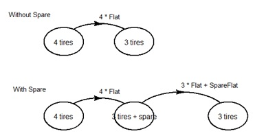

 

Markov models often referred to as Markov chains are ubiquitous in the world of
statistical analysis. In most Markov systems states are defined to describe the
system status. A fundamental principle of a Markov process is that the system
will transition from one state to another strictly on some probabilistic basis,
without knowledge or concern of any previous history. This excludes some forms
of potential analysis, but renders a structured system of modeling that has
proven useful in many cases.

For reliability and safety analysis a special case of the semi-Markov process
introduced in 1954 by Paul Levy is employed. This application of Markov modeling
considers the transitions from state to state occurring on the basis of constant
rates, exponentially random. Commonly transitions occur from some working state
to some form of failure state (either partial or complete). Correspondingly, but
not always, a repair transition can move the state back to a more complete
operational status.

Rate modeling has also been used in some queuing processes. The rates of
interest in such cases may be arrivals to the queue and dispatch rates from the
queue. The states would likely regard the size or content of the queue.

While there are many scholarly books and papers on Markov modeling theory with
mesmerizing equations and formulas this is not the intent of this discussion.
Rather it is desired to bring the technique to a potential analyst in a more
intuitive way.

A tool for such presentation has been introduced in “Modeling for Reliability
Analysis” by Jan and Paul Pukite. Unfortunately, the computer application
presented in that work, CARMS, was written for the 16-bit Windows 3.1 operating
system. In collaboration with Paul Pukite an emulation of this application has
been prepared to run on the cross-platform environment developed by the R
Project for Statistical Computing, or R for short. The R environment is
continuously developed such that it can be reasonably anticipated that a package
written for this environment will survive future evolution of computer
architectures and operating systems.

The CARMS way
-------------

The philosophy of user interaction with CARMS is to generate a graphic depiction
of the system states and draw connecting arrow notated lines, often arcs,
indicating transitions. The transitions are assigned rate values, often as
multiples or combination of base element rates. The user can specify a method of
solution for the system model. The software generates the applicable matrix
representing the partial differential equations defined by the transitions and
computes a solution by integration. Then a plot can be displayed of the history
of state probabilities over a given mission time.

An example here could be worth a thousand words. The earliest simple example
provided in “Modeling for Reliability Analysis” is entitled jeep. This example
actually presents two separate models on one diagram and analysis. The first
model represents a vehicle with 4 tires. Regardless of wear there is assumed to
be a constant risk of tire failure, represented by a rate of failure per mile.
In this simple model failed tires are neither fixed nor replaced, so the
probability of being stranded with only 3 operable tires is 1-exp(-failure_rate
\* time). Correspondingly the probability of having a jeep with all 4 tires
operable over time is easily anticipated to be exp(-failure_rate \* time).

These relationships can easily be modeled in an Excel spreadsheet. Use 4e-4 as
the failure rate for any one of original tires per mile. Times will be a series
of miles leading to 10000 miles to match the provided example. Maybe it wasn’t
obvious that “failure probability equals 1-e\^(-lambda t)” represents an exact
integration of the exponential failure rate function. Since the rate represents
a derivative of the function of interest, integration is required to obtain the
underlying function.

Now, the second model assumes that a spare is available, such that it is
immediately used upon failure of any one original tire. However, the spare is
perhaps just a doughnut and has a higher fail rate.

The diagram for these two models is depicted as:

The resultant plot of the solutions is:

It is not as easy to see how one could model the second case in a spreadsheet
where the probability of operating on 3 original tires and one spare initially
increases, but ultimately declines due to the failures of either one of the
original 3 tires or the spare. This delays the case where one is stranded with
only 3 operable tires. The answer to this dilemma is that the second case must
be integrated simultaneously through a series of integration intervals.

The original CARMS application aimed to largely obscure the details of
differential equation integration and produce graphical results from a user
generated diagram of the Markov model with rate data added.

The CARMS package
-----------------

The functionality of the original CARMS application has now been emulated in a
package for operation on the R platform. This brings CARMS to life on today’s
operating systems in a cross-platform way. Windows, Unix-like, and MacOS systems
can all run this tool as if a native application. It is necessary for a user to
install the R system in order to use the CARMS package. However, it is not
necessary to learn R programming to use it. Instructions for installing R are
provided on the R web site <https://www.r-project.org/>.

Once R has been installed on Windows, a rather terse window will open called the
console, it is actually a program named Rgui. From there it is simple to select
through menu items for Packages-\>Install package(s), selecting a mirror (just
as you did for the R installation itself) then scrolling down to CARMS.

This installation is only performed once on a freshly installed R system.
However, on every start of a new R instance it is necessary to load the library
into memory with the simple command library(CARMS) onto the console.

~~~~~~~~~~~~~~~~~~~~~~~~~~~~~~~~~~~~~~~~~~~~~~~~~~~~~~~~~~~~~~~~~~~~~~~~~~~~~~~~
library(CARMS)
~~~~~~~~~~~~~~~~~~~~~~~~~~~~~~~~~~~~~~~~~~~~~~~~~~~~~~~~~~~~~~~~~~~~~~~~~~~~~~~~

[ This writing has quickly become a Windows specific discussion. There are
significant differences while running under Linux or MacOS. Only Windows has the
Rgui.exe program to use as a console. On Linux (and assumed also for MacOS) in
its raw form R is an executable that opens in the terminal. This is not as
friendly a place to operate due to extreme terseness (no menus, and poor line
editing). For this reason, many users then opt for an application named RStudio.
While this application provides a Console pane, it also has a lot more things
going on that would take more time to discuss here. Windows users are
discouraged from using RStudio for this presentation.]

Now with the simple command demo(jeep) the initial example is displayed. Yes,
annoyingly it takes a few presses of the Enter key to complete.

An entire library of examples is also available. The command examples() will
list them. Any of the examples can be run by either calling the examples
function with the number of the example as a second argument after “run”. A
command of examples("run", 1)will run the jeep example again, but all at once.
It is also possible to copy an example name as an argument inside quotation
marks such as

~~~~~~~~~~~~~~~~~~~~~~~~~~~~~~~~~~~~~~~~~~~~~~~~~~~~~~~~~~~~~~~~~~~~~~~~~~~~~~~~
examples("run", "48_PerCPUIO.R")
~~~~~~~~~~~~~~~~~~~~~~~~~~~~~~~~~~~~~~~~~~~~~~~~~~~~~~~~~~~~~~~~~~~~~~~~~~~~~~~~

 

 CARMS object development and diagram building
----------------------------------------------

It has been said that “everything in R is an object”. In the case of this CARMS
emulation the information defining each model is stored in a carms object. The
carms object for any model is generated through execution of a series of script
lines. These script lines can be written on any text editor and will usually be
saved with the .R suffix. This is the method of persistence for all examples
that have been prepared.

The first script line command for forming a carms object is unsurprisingly
carms.make. One always gives an object name, the make.carms function must also
be given a title, which will be used to annotate its eventual plot.

~~~~~~~~~~~~~~~~~~~~~~~~~~~~~~~~~~~~~~~~~~~~~~~~~~~~~~~~~~~~~~~~~~~~~~~~~~~~~~~~
Pa2Simpl<-carms.make(title="Parallel        Same failure rates", diagram_grid=c(9,13))
~~~~~~~~~~~~~~~~~~~~~~~~~~~~~~~~~~~~~~~~~~~~~~~~~~~~~~~~~~~~~~~~~~~~~~~~~~~~~~~~

This line will establish an initial carms object named Pa2Simpl modeling 2
elements functioning in parallel. It is also defining a grid system for the
diagram that has 9 rows and 13 columns. This grid is applied to whatever output
plot size may eventually be defined.

Now to place a first state on the diagram the cams.state function is used. The
object building functions after carms.make all progressively modify the carms
object in memory. So the object name is used as the result of the function that
will act on the formative object provided as a first argument.

~~~~~~~~~~~~~~~~~~~~~~~~~~~~~~~~~~~~~~~~~~~~~~~~~~~~~~~~~~~~~~~~~~~~~~~~~~~~~~~~
Pa2Simpl<- carms.state(Pa2Simpl, prob=1.0, name="2 good", size=7, h2w=14/20, position=c(3,5) )
~~~~~~~~~~~~~~~~~~~~~~~~~~~~~~~~~~~~~~~~~~~~~~~~~~~~~~~~~~~~~~~~~~~~~~~~~~~~~~~~

The carms.state function defines the initial probability for the state, gives it
a display name, then establishes graphics properties as a relative size and a
specific position. The position values center the object ellipse at the center
of the grid column and row, as previously defined. In this case the first state
will be positioned toward the left margin at a vertical position in the middle
of the diagram. It is also possible to define the proportions of the ellipse,
but in this example a default has been used.

The next two states in this simple example are added to the carms object with
similar script lines.

~~~~~~~~~~~~~~~~~~~~~~~~~~~~~~~~~~~~~~~~~~~~~~~~~~~~~~~~~~~~~~~~~~~~~~~~~~~~~~~~
Pa2Simpl<-carms.state(Pa2Simpl, prob=0, name="1 failed", size=7, h2w=14/20, position=c(7,5) )
Pa2Simpl<-carms.state(Pa2Simpl, prob=0, name="2 failed", size=7, h2w=14/20, position=c(11,5) )
~~~~~~~~~~~~~~~~~~~~~~~~~~~~~~~~~~~~~~~~~~~~~~~~~~~~~~~~~~~~~~~~~~~~~~~~~~~~~~~~

These next states will be placed on the diagram progressively moving to the
right along the center of the diagram. Of course the initial state probabilities
for these subsequent states is zero. Once any state lines have been added to the
R script it is possible to get a preliminary view of the formative diagram
simply calling:

~~~~~~~~~~~~~~~~~~~~~~~~~~~~~~~~~~~~~~~~~~~~~~~~~~~~~~~~~~~~~~~~~~~~~~~~~~~~~~~~
diagram(Pa2Simpl)
~~~~~~~~~~~~~~~~~~~~~~~~~~~~~~~~~~~~~~~~~~~~~~~~~~~~~~~~~~~~~~~~~~~~~~~~~~~~~~~~

As a diagram is being developed it is common to make several views of the
diagram for trial and modification activity. One could say his makes diagram
building semi-interactive.

It is also possible to view the way that the carms object is stored in memory by
simply typing its name in the console. The carms object is a list construct
which is basic to R. It should be noted here that the state names given in
carms.state command lines are simply those that will appear on the diagram.
Internally the carms object identifies the states numerically in the order they
were entered. This can be seen in the list object Pa2Simpl\$state where the
state numbers are enclosed in double brackets.

~~~~~~~~~~~~~~~~~~~~~~~~~~~~~~~~~~~~~~~~~~~~~~~~~~~~~~~~~~~~~~~~~~~~~~~~~~~~~~~~
Pa2Simpl$state
~~~~~~~~~~~~~~~~~~~~~~~~~~~~~~~~~~~~~~~~~~~~~~~~~~~~~~~~~~~~~~~~~~~~~~~~~~~~~~~~

 

State transition definitions
----------------------------

Transitions are comprised of a directional sequence (from, to) and a numeric
rate. Often rates are defined by multiples or combinations of some base
elements. For this reason, CARMS provides a mechanism for storing such base
element rates. This is done using the carms.base function. As with carms.state
the carms.base function adds information to the carms object, so its result is
returned to the carms object name and the first argument is the carms object as
so far developed. In this first simple example there is only one base element,
and one might think this step could be dispensed with, however it is the only
location to indicate the units of time used for the model and must be provided.

~~~~~~~~~~~~~~~~~~~~~~~~~~~~~~~~~~~~~~~~~~~~~~~~~~~~~~~~~~~~~~~~~~~~~~~~~~~~~~~~
Pa2Simpl<-carms.base(Pa2Simpl, value=1.0, time_units="hours")
~~~~~~~~~~~~~~~~~~~~~~~~~~~~~~~~~~~~~~~~~~~~~~~~~~~~~~~~~~~~~~~~~~~~~~~~~~~~~~~~

The value of this base rate is later retrievable using lables B1, or b1 because
this was the first base value entered. Subsequent base values will be
retrievable using lables B2, B3 (or b2, b3) etcetera. It is also possible to
identify any base value with a particular base_label entered as a string
argument.

With this base value specified it is now possible to complete the definition of
the transitions in this simple model.

~~~~~~~~~~~~~~~~~~~~~~~~~~~~~~~~~~~~~~~~~~~~~~~~~~~~~~~~~~~~~~~~~~~~~~~~~~~~~~~~
Pa2Simpl<-carms.arrow(Pa2Simpl, from=1, to=2, rate="2*B1", arc=.35, label="2 * B1")
Pa2Simpl<-carms.arrow(Pa2Simpl, from=2, to=3, rate="B1", arc=.35, label="B1")
~~~~~~~~~~~~~~~~~~~~~~~~~~~~~~~~~~~~~~~~~~~~~~~~~~~~~~~~~~~~~~~~~~~~~~~~~~~~~~~~

Consistent with the apparent nomenclature from the original CARMS application
transitions are defined using the carms.arrow function. Using a familiar
technique of passing in the developing carms object as first argument continues.
It is instructive to note that although the rate and label are the same in this
example this is not always the case. The label string is the notation that will
be provided on the diagram.

It is possible to alter the appearance of the usually arcing arrow line by
providing positive or negative values to an arc argument. It is also possible to
alter the location of the arrow head (and its associated label) along a fraction
of the arc travel. Here defaults have been used.

With this base value specified it is now possible to complete the definition of
the only transition in this simple model.

Again by calling diagram(Pa2Simple) the effect of the specification for the
transition arrow(s) can be viewed and modified as found pleasing through perhaps
several trials.

~~~~~~~~~~~~~~~~~~~~~~~~~~~~~~~~~~~~~~~~~~~~~~~~~~~~~~~~~~~~~~~~~~~~~~~~~~~~~~~~
diagram(Pa2Simpl)
~~~~~~~~~~~~~~~~~~~~~~~~~~~~~~~~~~~~~~~~~~~~~~~~~~~~~~~~~~~~~~~~~~~~~~~~~~~~~~~~

With a model completely defined as has been done here, it is possible to run a
simulation on the model.

 

Implementing a solution
-----------------------

Three methods of integrating the rate defined model over mission time are
provided. The 4th order Runge-Kutta method is often specified, but can fail if
the model is “too tight”. Unfortunately, no one has provided a definition as to
what makes a model “too tight”.Suffice it to say some Runge-Kutta results make
no sense. For this reason, a second analytic method, the backward difference
method is also provided. Thirdly, a stochastic method is provided to develop the
chain over numerous randomized cycles through the mission time. The original
CARMS application developed this “chained” method using a Petri Net formalism.
The stochastic chain method provided in the CARMS package provides the same
result but takes advantage of the fact that all transitions are defined by
rates.  Due to high cycling, typically in the thousands of iterations, the
stochastic method would be expected to take more time. However, by coding this
in compiled C++ code most models can be resolved with little apparent delay.

The analytic methods in the CARMS package are implementations of algorithms
presented by William Stewart in “Introduction to the Numerical Solution of
Markov Chains”. The stochastic chain algorithm was developed independently
similar to methods used in R package stosim. For interested users the original
development of this algorithm in slow interpreted R code is also provided as a
basis for study. This working code can also be specified for any specific model.

The four solution arguments are “rk”, “bd”, “chain”, and “chain_R”. Each
solution method requires a mission time and a number of time intervals for
evaluation. A default of 50 intervals seems adequate for most models. The
chained method requires a specification for the number of cycles; 2000 is
provided as a default. Some model results provide more pleading curves with
increased cycling.

Once a carms object has been fully defined any call to the simulate function can
be made. The result of simulation is a matrix of probabilities fore each state
at each interval. This matrix is added to the carms object in the same manner
that all other model elements were. Subsequent calls to simulate on the same
carms object will replace the simulation matrix with the last requested result.

~~~~~~~~~~~~~~~~~~~~~~~~~~~~~~~~~~~~~~~~~~~~~~~~~~~~~~~~~~~~~~~~~~~~~~~~~~~~~~~~
Pa2Simpl<-simulate.carms(Pa2Simpl, solution="rk", mission_time=5, intervals=50)
~~~~~~~~~~~~~~~~~~~~~~~~~~~~~~~~~~~~~~~~~~~~~~~~~~~~~~~~~~~~~~~~~~~~~~~~~~~~~~~~

With a simulation provided to the carms object, the final step is to display a
plotted result.

~~~~~~~~~~~~~~~~~~~~~~~~~~~~~~~~~~~~~~~~~~~~~~~~~~~~~~~~~~~~~~~~~~~~~~~~~~~~~~~~
plot(Pa2Simpl)
~~~~~~~~~~~~~~~~~~~~~~~~~~~~~~~~~~~~~~~~~~~~~~~~~~~~~~~~~~~~~~~~~~~~~~~~~~~~~~~~

